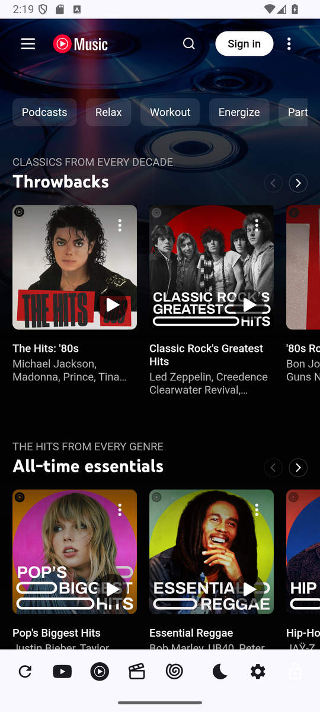
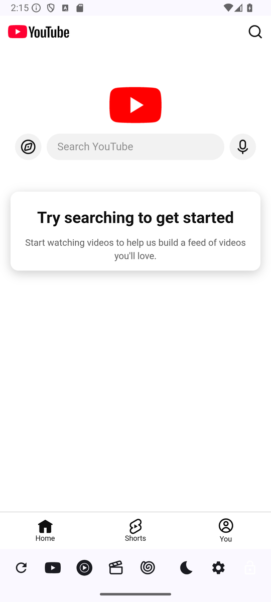
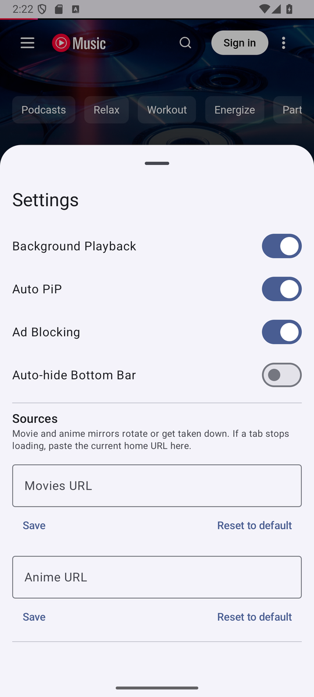
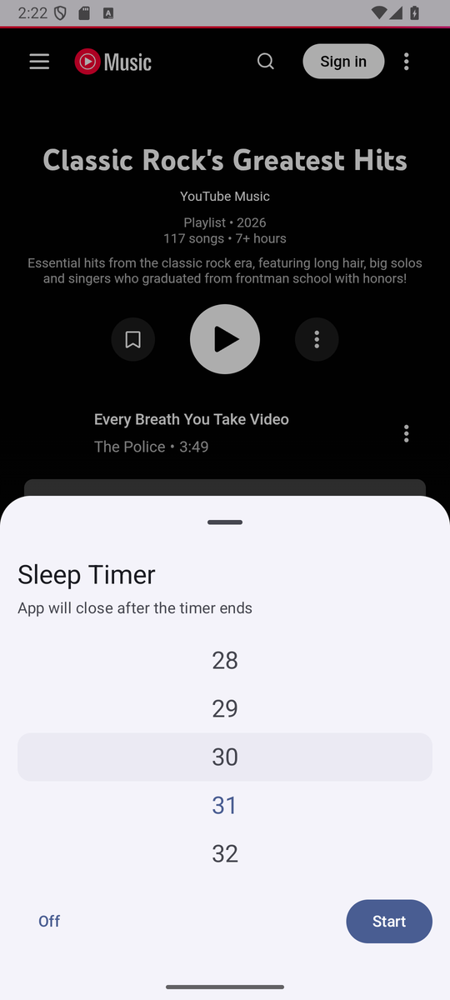
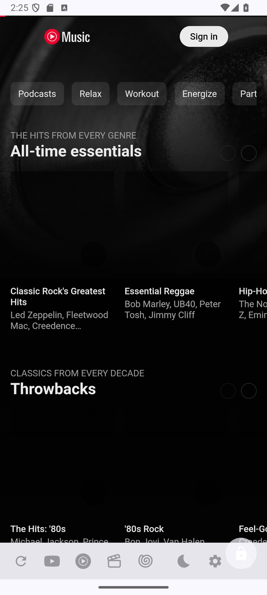
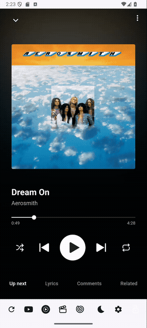
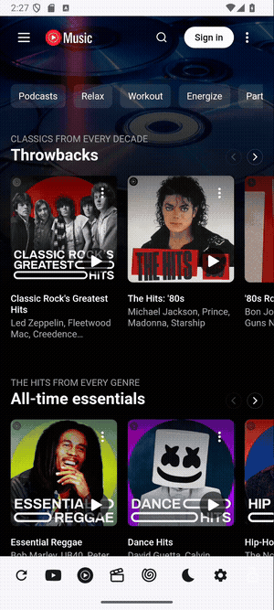
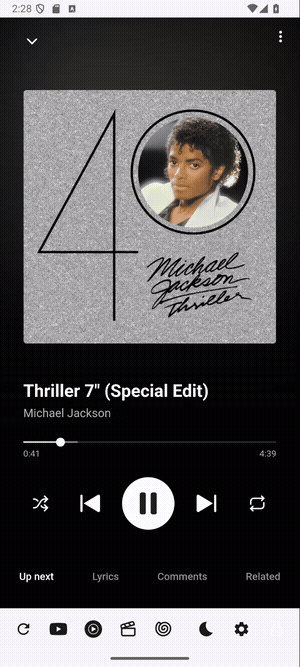
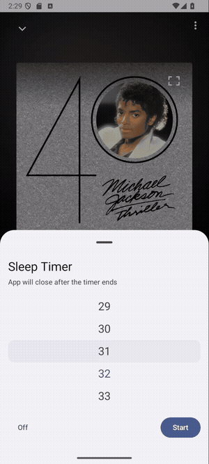

<div align="center">


# MyTube

**An all-in-one Android shell for YouTube, YouTube Music, Movies and Anime — with ad blocking, background playback, sleep timer, screen lock and Picture-in-Picture.**

[](https://github.com/Isaac-1555/MyTube_Android/releases/latest)
[](https://github.com/Isaac-1555/MyTube_Android/releases)
[](#requirements)
[](https://kotlinlang.org)

<a href="https://github.com/Isaac-1555/MyTube_Android/releases/latest"></a>

</div>

---

## Screenshots

| YouTube Music | YouTube | Settings | Sleep Timer | Screen Lock |
| :-----------: | :-----: | :------: | :---------: | :---------: |
|  |  |  |  |  |

## Demos

**Switch between tabs**



**Settings**



**Sleep timer**



**Auto-hide bottom bar**



---

## Features

- **Four tabs in one app** — YouTube, YouTube Music, Movies and Anime.
- **Isolated profiles** — Movies and Anime run in separate WebView profiles, so their cookies/storage never mix with YouTube.
- **Ad blocking** — hosts-based blocking plus uBlock-style scriptlets, with a filter list that updates itself.
- **Background playback** — foreground media service keeps audio running when the screen is off or the app is backgrounded.
- **Rich media controls** — play/pause, real previous/next, stop and artwork-driven tint in the notification and on the lock screen (Android 13+).
- **Picture-in-Picture** — manual PiP and optional auto-PiP when you leave the app; page chrome is hidden so only the video shows.
- **Sleep timer** — 1 to 120 minutes with a snap wheel; the app closes itself when the timer ends.
- **Screen lock** — freeze the page and ignore touches, ideal when handing the phone to someone.
- **Edge-swipe navigation** — swipe from the left edge to go back, right edge to go forward.
- **Auto-hide bottom bar** — the bar fades away after 5s of inactivity and returns on touch.
- **Configurable sources** — if a Movies/Anime mirror rotates or goes down, paste a new home URL in Settings.

## Download & Install

Grab the latest signed APK from the **[Releases page](https://github.com/Isaac-1555/MyTube_Android/releases/latest)**.

Direct download: **[MyTube-v2.8.9-release.apk](https://github.com/Isaac-1555/MyTube_Android/releases/download/v2.8.9/MyTube-v2.8.9-release.apk)**

### Install on Android

1. Download the `.apk` file on your phone (or transfer it).
2. When prompted, allow your browser/file manager to **install unknown apps**
   (*Settings → Apps → Special access → Install unknown apps*).
3. Open the APK and tap **Install**.
4. On first launch, grant **notifications** if you want media controls on the lock screen and in the shade.

### Install with ADB

```bash
adb install MyTube-v2.8.9-release.apk
```

### Requirements

- Android **7.0 (API 24)** or newer (`minSdk 24`, `targetSdk 36`).
- An internet connection for streaming.

### Verify the download (optional)

```bash
apksigner verify --print-certs MyTube-v2.8.9-release.apk
```

The release is signed with APK Signature Scheme v2. Certificate SHA-256:

```
EB:37:C6:84:4E:4A:BC:DC:68:D7:63:8C:3D:9C:DA:78:
AE:C5:7A:1E:E1:30:1C:A8:31:4D:C9:F5:84:39:D8:F4
```

---

## Usage

The bottom bar is the only chrome the app draws — everything above it is the real website.

| Icon | Action |
| :--- | :----- |
| ⟳ **Reload** | Reload the current page |
| ▶ **YouTube** | Switch to the YouTube tab |
| Ⓜ **YouTube Music** | Switch to the YouTube Music tab |
| 🎬 **Movies** | Switch to the Movies tab (isolated profile) |
| 🌀 **Anime** | Switch to the Anime tab (isolated profile) |
| 🌙 **Sleep timer** | Set a timer (1–120 min); the remaining time shows next to the icon |
| ⚙ **Settings** | Open the settings sheet |
| 🔒 **Lock** | Freeze the page and block touches; tap the lock chip to unlock |

- **Go back / forward** — swipe in from the left or right edge of the screen.
- **Exit** — swiping back from your first page shows an *Exit MyTube?* dialog.
- **Picture-in-Picture** — leave the app to enter PiP (enable **Auto PiP** in Settings), or use the system gesture.
- **Bottom bar** — hides after 5 seconds when **Auto-hide Bottom Bar** is enabled; tap anywhere to bring it back.

### Settings

| Setting | Description |
| :------ | :---------- |
| **Background Playback** | Keep audio playing when the app is not in the foreground |
| **Auto PiP** | Automatically enter Picture-in-Picture when you leave the app |
| **Ad Blocking** | Enable hosts + scriptlet based ad blocking |
| **Auto-hide Bottom Bar** | Hide the bottom controls after a few seconds of inactivity |
| **Movies URL / Anime URL** | Override the mirror used by the Movies and Anime tabs |

> Movies and Anime rely on public streaming mirrors that rotate or get taken down. If a tab stops loading, open **Settings** and paste the current home URL.

---

## Build from source

### Requirements

- JDK 17 or newer
- Android SDK with **build-tools 36.0.0** and **platform 36**
- `local.properties` pointing at your SDK (`sdk.dir=/path/to/Android/sdk`)

### Debug build

```bash
./gradlew assembleDebug
# app/build/outputs/apk/debug/app-debug.apk
```

### Release build (signed)

Create `keystore.properties` in the project root:

```properties
storeFile=mytube-release.jks
storePassword=********
keyAlias=mytube
keyPassword=********
```

Then build:

```bash
./gradlew assembleRelease
# app/build/outputs/apk/release/app-release.apk
```

`keystore.properties`, `*.jks` and `*.keystore` are git-ignored — never commit your signing keys.

## Tech stack

- **Kotlin** + **Jetpack Compose** (Material 3) UI
- **AndroidX WebKit** WebViews with per-tab profiles
- **MediaSession / PlaybackService** foreground service for playback controls
- **DataStore** preferences and **Room**-backed script storage
- **Palette** for artwork-tinted media controls
- Gradle **9.7.1**, Android Gradle Plugin **9.4.1**

## Disclaimer

MyTube is an unofficial wrapper and is not affiliated with, endorsed by, or sponsored by YouTube or Google. It renders third-party websites; availability of those sites is outside this project's control. Respect the terms of service and the laws that apply to you.

## License

No license is currently provided for this repository.
